# 📊 My MF Dashboard

A comprehensive web-based portfolio tracker for Indian mutual fund investors. Track your investments, analyze performance, calculate capital gains, and monitor your portfolio with beautiful visualizations - all running locally in your browser!


## ✨ Features

### 📈 Portfolio Analytics

- **Real-time Portfolio Tracking**: Monitor current value, gains/losses, and returns
- **Asset Allocation**: Visualize distribution across equity, debt, gold, and other assets
- **Market Cap Analysis**: Track large-cap, mid-cap, and small-cap exposure
- **Sector Distribution**: Understand your equity sector allocation
- **Fund House Distribution**: See your AMC-wise portfolio split
- **Holdings Analysis**: Deep dive into individual stock holdings across funds

### 💰 Performance Metrics

- **XIRR Calculation**: Accurate returns calculation using Extended Internal Rate of Return
- **Absolute Returns**: Track overall and individual fund performance
- **Realized vs Unrealized Gains**: Separate tracking of booked and paper profits
- **Weighted Portfolio Returns**: 1Y, 3Y, and 5Y weighted returns across all holdings
- **Fund-Level XIRR**: Individual XIRR calculation for each fund

### 📊 Visual Analytics

- **Interactive Charts**: Beautiful Chart.js visualizations for all metrics
- **Growth Tracking**: Monitor portfolio value over time with daily valuation
- **Investment Flow**: Track monthly/quarterly/yearly investments and redemptions
- **Fund Valuation History**: Individual fund performance charts
- **Performance Comparison**: Compare fund vs category vs benchmark returns

### 💸 Capital Gains

- **Tax Calculation**: Automatic STCG and LTCG calculation with proper categorization
- **Financial Year Reports**: Year-wise capital gains breakdown
- **Transaction-Level Details**: FIFO-based cost basis tracking
- **Downloadable Reports**: Export capital gains as Excel files (FY-wise or all-time)
- **Current Year Tracking**: Real-time tracking of current financial year gains

### 📝 Transaction Management

- **Complete Transaction History**: All purchases, redemptions, and switches
- **Fund-wise Transactions**: Detailed transaction view for each fund
- **Folio-wise Tracking**: Separate tracking for multiple folios
- **Excel Export**: Download transaction reports in XLSX format
- **Real-time NAV Updates**: Fetch latest NAV data automatically

### 🔒 Data Management

- **Local Storage**: All data stored in browser's IndexedDB
- **No Server Storage**: Your financial data never leaves your device
- **Auto-Updates**: Intelligent daily NAV and monthly stats updates
- **Cache Control**: Manual cache refresh and clear options
- **Duplicate Prevention**: Smart detection of already uploaded CAS files

## 🔄 Auto-Update Features

The application automatically keeps your portfolio data fresh:

### Daily NAV Updates ⏰

- **Automatic**: Every day when you load the app, the latest NAV is fetched automatically
- **Manual**: Trigger updates from the Upload CAS tab
- **Restriction**: Once per day to avoid unnecessary API calls (allows one manual update)
- **Incremental**: Only new NAV data is fetched and merged with existing history
- **Silent Operation**: Updates happen seamlessly in the background

### Monthly Fund Statistics Updates 📅

- **Automatic**: After the 10th of every month, complete fund statistics are updated
- **Comprehensive Data**: Portfolio composition, returns, ratings, holdings, expense ratios
- **Manual Trigger**: Available from Upload CAS tab
- **Restriction**: Once per month (after 10th & allows one manual update)
- **Background Process**: Non-blocking updates for smooth user experience

### Smart Update Tracking

The dashboard footer displays:

- **Last CAS Parsed**: When you last uploaded a CAS file
- **Stats Updated**: When fund statistics were last updated
- **NAV Updated**: When NAV values were last refreshed

## 📸 Screenshots

### CAS Upload

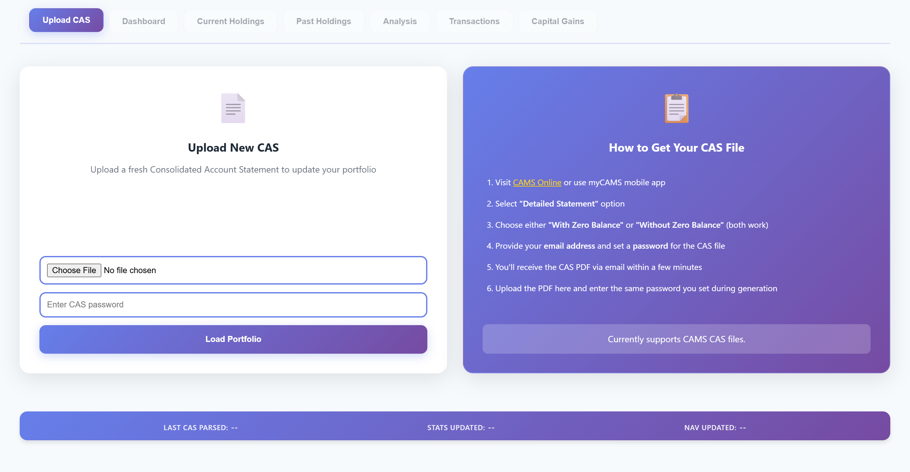
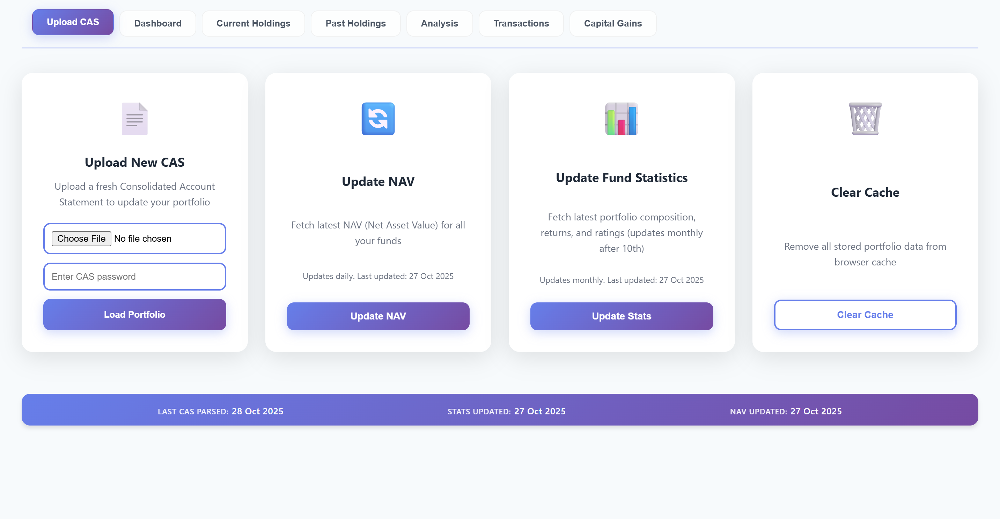

Upload your CAS. View last update details, Clear Cache, monitor auto update details.

### Dashboard

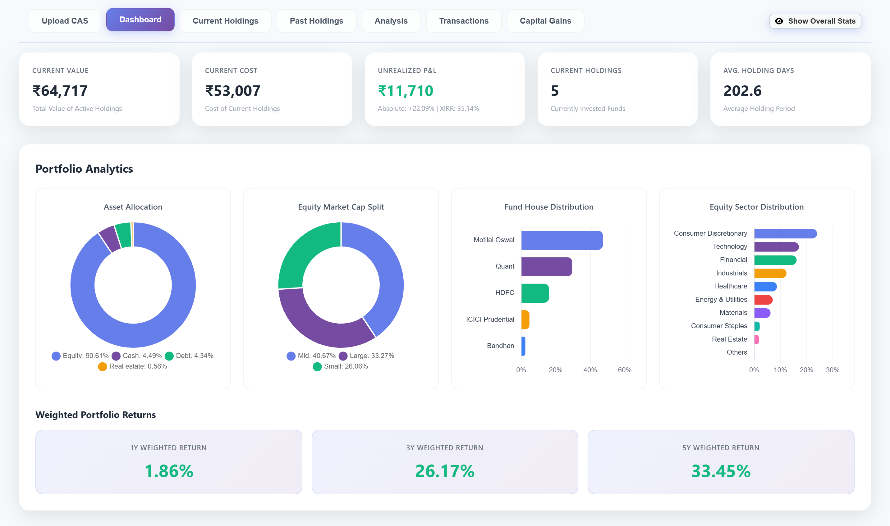

The main dashboard provides a comprehensive view of your portfolio with key metrics, portfolio analytics, and interactive visualizations.

---

### Current Holdings

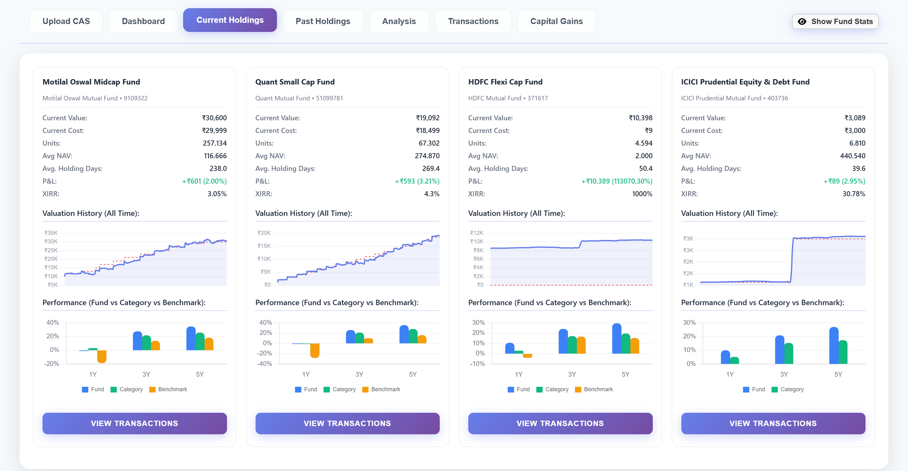
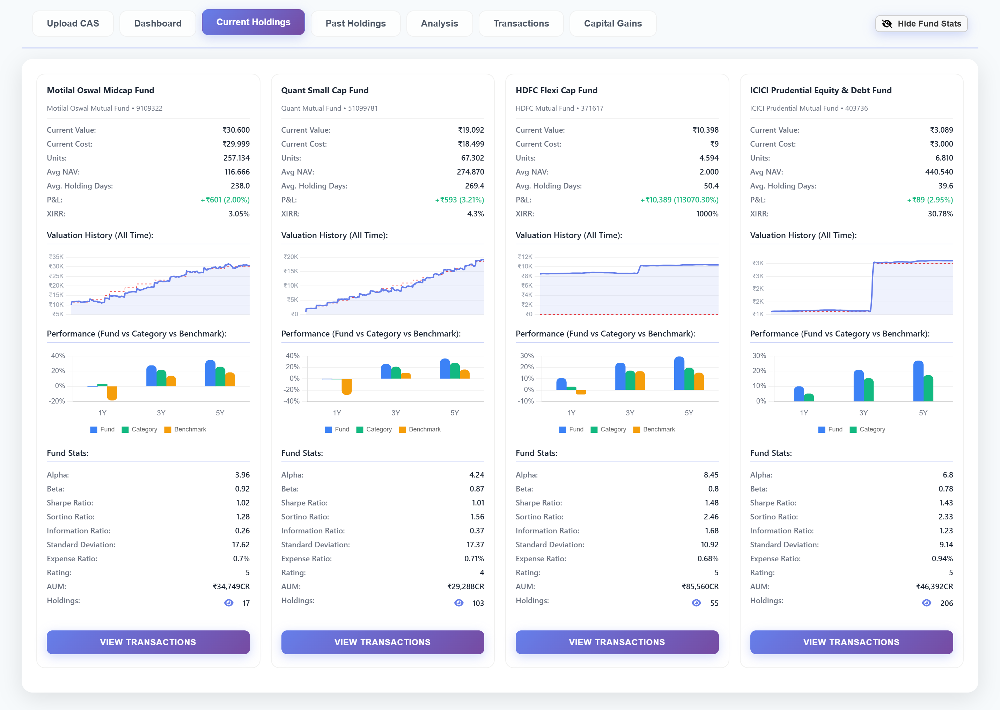

Detailed view of all active investments with fund-level statistics, valuation charts, and performance metrics.

---

### Past Holdings

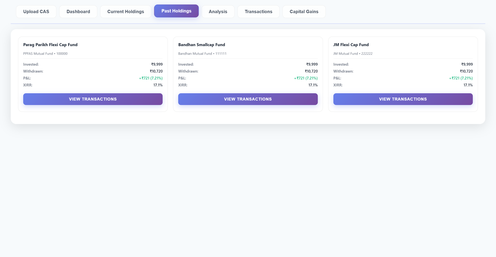

See your past holdings and realized gains.

---

### Portfolio Analysis

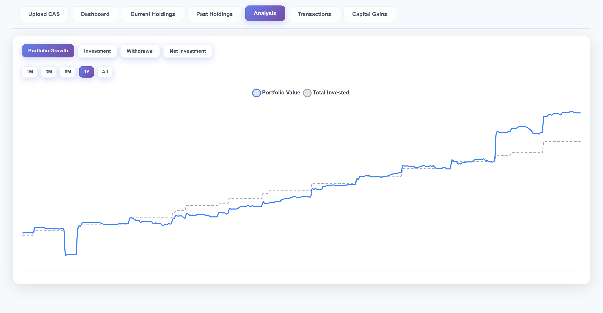
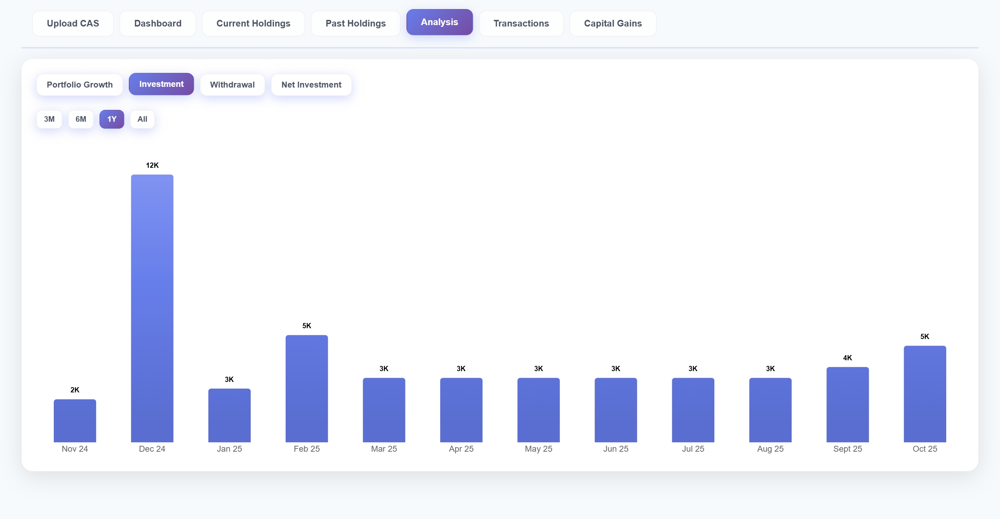
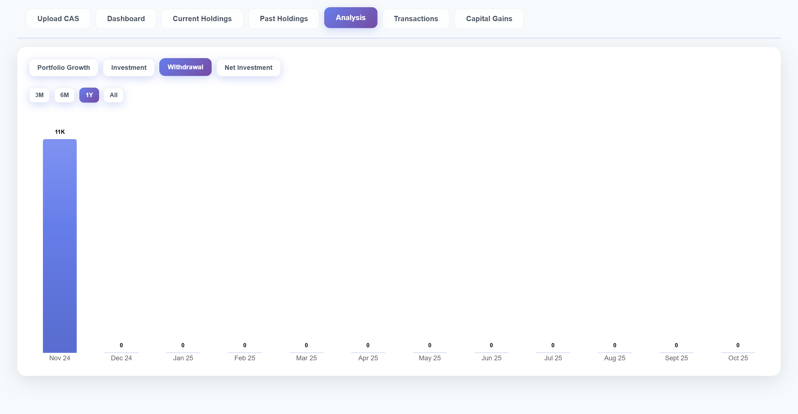
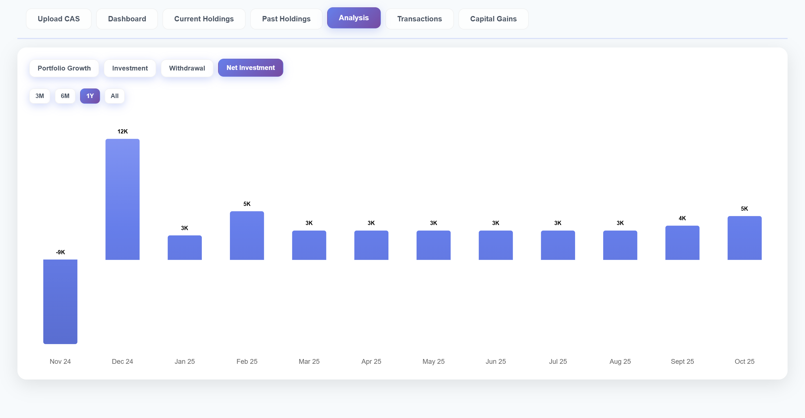

Track your portfolio value over time with interactive charts showing value vs cost with multiple time period filters.

---

### Capital Gains Analysis

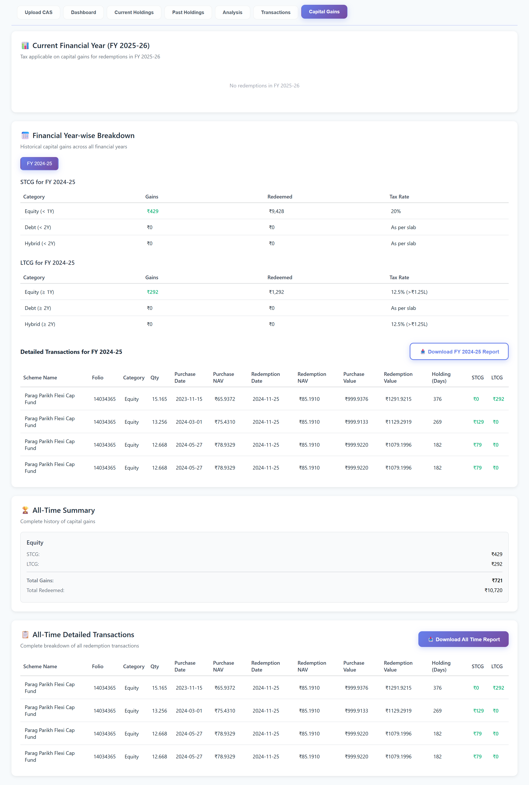

Financial year-wise breakdown of capital gains with STCG/LTCG calculations and downloadable tax reports.

---

### Transaction History

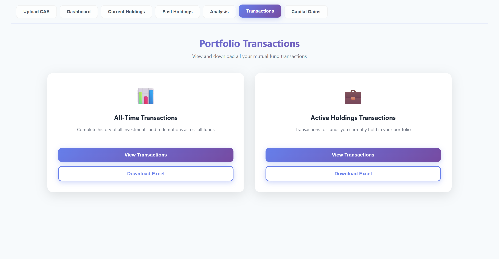

Complete transaction history with folio-wise tracking and Excel export functionality.

## 🚀 Getting Started

### Prerequisites

- Modern web browser (Chrome 90+, Firefox 88+, Safari 14+, Edge 90+)
- Internet connection for initial setup and updates
- CAMS CAS statement (password-protected PDF)

### Live Demo

Visit the live application: [My MF Dashboard](https://mf-dashboard.github.io)

### Local Setup

1. **Clone the repository**

```bash
git clone https://github.com/mf-dashboard/mf-dashboard.github.io.git
cd mf-dashboard.github.io
```

2. **Serve the files**

- Install "Live Server" extension in VS Code
- Right-click `index.html` → Open with Live Server

3. **Open in browser**

```
http://localhost:8000
```

## 📂 Project Structure

```
mf-dashboard/
├── index.html              # Main HTML file with all sections
├── styles.css              # Complete application styles
├── script.js               # Core application logic (~3500 lines)
├── indexeddb-helper.js     # IndexedDB storage manager
├── data/
│   └── search-key.json     # ISIN to search key mapping
├── img/
│   └── favicon.*           # App icons and favicons
└── README.md               # This file
```

## 🔧 Configuration

### Backend Server

The application connects to a backend API for:

- CAS parsing
- MF statistics fetching
- NAV updates

**Backend URL**: `https://my-mf-dashboard-backend.onrender.com`

To use your own backend, update the `BACKEND_SERVER` constant in `script.js`:

```javascript
const BACKEND_SERVER = "https://your-backend-url.com";
```

### API Dependencies

The backend uses:

- **Groww API**: Fund details and statistics
- **MFAPI**: NAV history

## 📥 How to Get Your CAS File

### Step-by-Step Guide

1. **Visit CAMS Portal**

   - Go to [CAMS Online](https://www.camsonline.com/Investors/Statements/Consolidated-Account-Statement)
   - Or use the **myCAMS mobile app**

2. **Request CAS**

   - Select **"Detailed Statement"** option
   - Choose either **"With Zero Balance"** or **"Without Zero Balance"**
   - Provide your **email address**
   - Set a **password** for the CAS file

3. **Receive CAS**

   - You'll receive the password-protected PDF via email within minutes
   - Download the CAS file to your device

4. **Upload to Dashboard**
   - Open the application
   - Go to **Upload CAS** tab
   - Select the downloaded PDF
   - Enter the password
   - Click **Load Portfolio**

### Important Notes

- Currently supports **CAMS CAS files only**
- KFINTECH support may have parsing issues
- The password is only used for decryption on the backend
- Your data is processed and stored locally in your browser

## 📊 Usage Guide

### 1. First Time Setup

1. Upload your CAS file with password
2. Wait for processing (30-60 seconds for large portfolios)
3. All fund statistics and NAV data will be fetched automatically
4. Data is saved locally in IndexedDB

### 2. Dashboard Overview

**Summary Cards** show:

- Current Value & Cost
- Unrealized P&L with XIRR
- Current Holdings count
- Average Holding Days
- All-time metrics (expandable)

**Portfolio Analytics** display:

- Asset Allocation (doughnut chart)
- Market Cap Split (doughnut chart)
- Fund House Distribution (bar chart)
- Sector Distribution (bar chart)
- Top Holdings (bar chart)
- Weighted Portfolio Returns

### 3. Current Holdings Tab

View all active funds with:

- Basic metrics (value, cost, units, P&L)
- Fund valuation history chart
- Performance comparison (Fund vs Category vs Benchmark)
- Extended stats (toggle to show):
  - Alpha, Beta, Sharpe Ratio
  - Sortino Ratio, Information Ratio
  - Standard Deviation, Expense Ratio
  - AUM, Rating
  - Holdings count with detailed view
- Transaction history button

### 4. Past Holdings Tab

Track redeemed/closed positions:

- Total invested & withdrawn
- Realized P&L
- Transaction history

### 5. Analysis Tab

Interactive charts with time filters:

- **Portfolio Growth**: Value over time vs Cost
- **Investment**: Monthly/quarterly investment flow
- **Withdrawal**: Redemption patterns
- **Net Investment**: Net cash flow

Time periods: 1M, 3M, 6M, 1Y, 2Y, 3Y, 4Y, 5Y, 7Y, 10Y, All

### 6. Transactions Tab

Two comprehensive views:

- **All-Time Transactions**: Complete history
- **Active Holdings**: Current positions only

Features:

- View in modal overlay
- Download as Excel
- Sortable by date
- Color-coded (Buy/Sell)

### 7. Capital Gains Tab

**Current Financial Year**:

- STCG and LTCG summary
- Tax rates by category
- Transaction breakdown

**Financial Year-wise**:

- Year selector
- Detailed transactions
- Download FY-specific reports

**All-Time Summary**:

- Complete gains history
- Category-wise breakdown
- Downloadable Excel report

### 8. Upload CAS Tab

Management options:

- **Upload New CAS**: Fresh portfolio upload
- **Update NAV**: Daily NAV refresh (once per day)
- **Update Fund Statistics**: Monthly full update (after 10th)
- **Clear Cache**: Remove all stored data
- **Instructions**: Detailed guide for getting CAS

Footer shows:

- Last CAS parsed date
- Last stats update date
- Last NAV update date

## 🧮 Calculations & Methodology

### XIRR (Extended Internal Rate of Return)

**Algorithm**: Newton-Raphson method with bisection fallback

**Process**:

1. Collect all cash flows (purchases as negative, redemptions as positive)
2. Add current value as final positive cash flow
3. Use iterative calculation to find IRR
4. Handles edge cases and convergence issues

**Calculated for**:

- Overall portfolio (all-time)
- Active holdings only
- Individual funds

### Capital Gains (FIFO Method)

**Equity Funds**:

- Short Term: < 1 year (20% tax)
- Long Term: ≥ 1 year (12.5% tax on gains > ₹1.25L)

**Debt Funds**:

- Short Term: < 2 years (As per slab)
- Long Term: ≥ 2 years (As per slab)

**Hybrid Funds**:

- Treated as debt for holding period calculation
- Short Term: < 2 years
- Long Term: ≥ 2 years

**Process**:

1. Maintain unit queue for each fund
2. On redemption, match against oldest units first (FIFO)
3. Calculate holding period for each batch
4. Categorize as STCG or LTCG
5. Track realized gains by financial year

### Portfolio Analytics

**Asset Allocation**:

- Uses fund-level asset allocation from extended data
- Weighted by current value
- Falls back to category-based classification

**Market Cap Split**:

- Based on fund portfolio statistics
- Weighted allocation across large/mid/small cap
- Normalized to 100%

**Sector Distribution**:

- Aggregates equity sector exposure
- Top 10 sectors shown individually
- Others grouped together

**Holdings Analysis**:

- Aggregates individual stock holdings across funds
- Filters holdings < 0.01% into "Others"
- Shows nature, sector, instrument details

### Weighted Returns

Formula: `Σ(Return × Weight)` where weight = fund value / total portfolio value

Calculated for:

- 1 Year Returns
- 3 Year Returns
- 5 Year Returns

## 🎨 Key Features Explained

### Smart CAS Upload

- **Duplicate Detection**: Generates file signature using content hash
- **Prevents Re-upload**: Warns if same file is uploaded again
- **File Signature**: Based on file size, content hash, and binary fingerprint
- **Persists**: Stores signature in localStorage

### Fund Valuation History

**Daily Valuation Calculation**:

1. Uses NAV history from backend
2. Processes all transactions chronologically
3. Calculates units and value for each day
4. Stores in `dailyValuation` array
5. Used for fund-level and portfolio-level charts

**Portfolio Aggregation**:

- Combines all fund daily valuations
- Sums values and costs by date
- Calculates unrealized gains
- Powers the Growth chart

### Folio-wise Tracking

**Multiple Folios**:

- Same fund can have multiple folios
- Separate tracking for each folio
- Aggregated view in fund cards
- Individual transaction tracking

**Folio Summary**:

- Invested amount
- Withdrawn amount
- Realized gains
- Remaining units and cost
- Current value and unrealized gains
- Cash flow history

### Extended Fund Statistics

**From Groww API**:

- Portfolio composition
- Risk metrics (Alpha, Beta, Sharpe, Sortino)
- Returns (1Y, 3Y, 5Y)
- Category averages
- Benchmark comparison
- Holdings details
- AUM, Expense Ratio, Rating

**From MFAPI**:

- Complete NAV history
- Latest NAV and date
- Scheme metadata

### Holdings Analysis

**Portfolio Level**:

- Aggregates all fund holdings weighted by value
- Shows top 200 holdings
- Groups < 0.01% into "Others"
- Downloadable Excel report

**Fund Level**:

- Individual fund holdings
- Includes Cash Equivalents if holdings < 100%
- Shows nature, sector, instrument
- Downloadable per-fund reports

### Transaction Views

**Fund Transactions**:

- Accessed via "View Transactions" button
- Shows all transactions for selected fund
- Filtered by folio if multiple folios exist
- Sortable and downloadable

**Portfolio Transactions**:

- All-time: Every transaction ever made
- Active Holdings: Only for current positions
- Includes valuation as final cash flow for XIRR

### Chart Animations

**Smooth Transitions**:

- 800ms easing animations
- Loading states for async operations
- Spinner placeholders
- Progressive data loading

**Responsive Design**:

- Auto-adjusts for mobile/tablet/desktop
- Smart label rotation
- Appropriate aggregation (monthly/quarterly/yearly)
- Touch-friendly interactions

## 🛡️ Security & Privacy

- ✅ **100% Client-Side Storage**: All data in browser IndexedDB
- ✅ **No User Tracking**: Zero analytics or tracking scripts
- ✅ **No Login Required**: No user accounts or authentication
- ✅ **Secure Processing**: CAS password used only for backend decryption
- ✅ **Temporary Server Storage**: Files deleted immediately after parsing
- ✅ **HTTPS Only**: Secure communication with backend
- ✅ **No Third-Party Scripts**: Except CDN-hosted libraries (Chart.js, XLSX)

## 🛠️ Technologies Used

### Core Technologies

- **Vanilla JavaScript (ES6+)**: No frameworks, pure JS
- **HTML5**: Semantic markup
- **CSS3**: Modern styling with flexbox/grid

### Libraries (CDN)

- **Chart.js 3.9.1**: Data visualizations
- **chartjs-plugin-datalabels 2.0**: Chart labels
- **SheetJS (XLSX) 0.18.5**: Excel export
- **Font Awesome 6.5.0**: Icons

### Browser APIs

- **IndexedDB**: Persistent local storage
- **Fetch API**: Network requests
- **File API**: CAS file handling
- **Web Storage API**: Simple key-value storage

### Backend Stack

- **Node.js + Express**: API server
- **Multer**: File upload handling
- **pdfreader**: PDF parsing
- **node-fetch**: HTTP requests

## 📱 Browser Support

### Fully Supported ✅

- Chrome 90+
- Firefox 88+
- Edge 90+
- Safari 14+

### Requirements

- IndexedDB support
- ES6+ JavaScript
- Fetch API
- File API

### Not Supported ❌

- Internet Explorer
- Very old mobile browsers
- Browsers without IndexedDB

## ⚠️ Limitations & Known Issues

### Performance Considerations

**Large Portfolios**:

- 100+ funds: 30-60 seconds initial load
- 150+ funds: May experience slowness
- Daily valuation calculation is async to prevent UI blocking

**Backend Performance**:

- Free-tier hosting (Render)
- Cold starts after 15 minutes inactivity
- First request may take 30-60 seconds
- Subsequent requests are faster

### CAS File Support

| Format    | Support Level      |
| --------- | ------------------ |
| CAMS      | ✅ Fully Supported |
| KFINTECH  | ⚠️ Partial Support |
| CDSL/NSDL | ❌ Not Supported   |

**Mutual Funds Only**: This is a dedicated MF tracker, not for stocks/bonds

### API Dependencies

**Groww API**:

- Not an official API
- May change structure without notice
- Rate limiting may apply

**MFAPI**:

- Public API
- Historical data typically 3-5 years
- May have occasional downtime

### Data Accuracy

**Capital Gains**:

- Calculations are indicative
- Should be verified with official tax statements
- Tax laws subject to change

**NAV Values**:

- Depend on external API accuracy
- May have 1-2 day delay
- Fund house data is source of truth

### Storage Limits

**IndexedDB**:

- Browser-dependent limits (typically 50MB+)
- May need to clear cache for very large portfolios
- Data persists until manually cleared

### Update Restrictions

**NAV Updates**:

- Maximum once per day
- Prevents API abuse
- Manual override via cache clear

**Stats Updates**:

- Maximum once per month
- Only after 10th of month
- Aligns with fund house reporting

## 🐛 Troubleshooting

### Common Issues

**1. CAS Upload Fails**

- Check password is correct
- Ensure file is CAMS detailed CAS
- Try clearing cache and re-uploading
- Check browser console for errors

**2. NAV Update Fails**

- Already updated today? Check footer dates
- Backend may be slow (free tier cold start)
- Try manual update from Upload CAS tab
- Check internet connection

**3. Charts Not Loading**

- Wait for data to load completely
- Check browser console for errors
- Try refreshing the page
- Clear cache and reload

**4. IndexedDB Errors**

- Browser may have storage limits reached
- Private/Incognito mode may restrict IndexedDB
- Try clearing browser cache
- Check browser settings for IndexedDB

**5. Backend Not Responding**

- Free tier may be sleeping (cold start)
- Wait 30-60 seconds and retry
- Check backend status: `https://my-mf-dashboard-backend.onrender.com/health`

### Debug Mode

Open browser console (F12) to see:

- Detailed error messages
- API request/response logs
- Data processing steps
- Performance metrics

## 🤝 Contributing

Contributions are welcome! Here's how you can help:

### Ways to Contribute

1. **Bug Reports**: Open an issue with details
2. **Feature Requests**: Suggest improvements
3. **Code Contributions**: Submit pull requests
4. **Documentation**: Improve README or add guides
5. **Testing**: Test on different devices/browsers

### Development Setup

1. Fork the repository
2. Create a feature branch
3. Make your changes
4. Test thoroughly
5. Submit a pull request

### Code Style

- Use meaningful variable names
- Add comments for complex logic
- Follow existing code patterns
- Ensure mobile responsiveness

## 📄 License

This project is licensed under the MIT License - see the [LICENSE](LICENSE) file for details.

**You are free to**:

- Use commercially
- Modify
- Distribute
- Use privately

**Conditions**:

- Include original license
- State changes made

## 👨‍💻 Author

**Pabitra Swain**

- 🌐 GitHub: [@the-sdet](https://github.com/the-sdet) | [@pabitra-qa](https://github.com/pabitra-qa)
- 📧 Email: pabitra.swain.work@gmail.com
- 💼 LinkedIn: [Connect with me](https://www.linkedin.com/in/pswain7/)

## 🙏 Acknowledgments

- **CAMS** for providing CAS statements
- **Groww** for the mutual fund API
- **MFAPI** for NAV history data
- **Chart.js** team for beautiful visualizations
- **SheetJS** for Excel export functionality
- All users who provide valuable feedback

## 📞 Support

**Need Help?**

- 📧 Email: pabitra.swain.work@gmail.com
- 🐛 Issues: [GitHub Issues](https://github.com/mf-dashboard/mf-dashboard.github.io/issues)
- 💬 Discussions: [GitHub Discussions](https://github.com/mf-dashboard/mf-dashboard.github.io/discussions)

**Before Asking**:

- Check this README
- Look at existing issues
- Try troubleshooting steps
- Check browser console for errors

## 🗓️ Changelog

### Version 1.0.0 (Current)

**Features**:

- ✅ Complete portfolio tracking with FIFO calculations
- ✅ Auto-update system (daily NAV, monthly stats)
- ✅ Capital gains with FY-wise breakdown
- ✅ Transaction management with Excel export
- ✅ Portfolio analytics and visualizations
- ✅ Holdings analysis (portfolio + fund level)
- ✅ Extended fund statistics
- ✅ Duplicate CAS prevention
- ✅ Comprehensive instructions

**Improvements**:

- Enhanced error handling
- Better user feedback (toasts)
- Smooth animations
- Responsive design
- Performance optimizations

### Roadmap

**Upcoming Features**:

- 📱 Progressive Web App (PWA)
- 🔄 KFINTECH full support
- 🎯 Asset allocation recommendations
- 📱 Multiple portfolio support
- 🌙 Dark mode
- 📤 PDF export

## ⚖️ Disclaimer

**⚠️ IMPORTANT - PLEASE READ CAREFULLY**

This application is provided **"AS IS"** for **informational and educational purposes only**.

**Financial Advice**:

- This is NOT financial advice
- Not a substitute for professional financial planning
- Always consult a qualified financial advisor
- Past performance does not guarantee future results

**Tax Calculations**:

- Capital gains calculations are **indicative only**
- Must be verified with official tax statements
- Consult a Chartered Accountant for tax filing
- Tax laws are subject to change without notice

**Data Accuracy**:

- NAV and fund data from third-party APIs
- No guarantee of accuracy or completeness
- May have delays of 1-2 days
- Fund house data is the official source

**Liability**:

- Developer assumes NO responsibility for:
  - Investment decisions made using this tool
  - Financial losses of any kind
  - Tax calculation errors or omissions
  - Data inaccuracies or API failures
  - Any damages arising from use of this tool

**Privacy**:

- Your data is stored locally on your device
- No data is transmitted except for public API calls
- You are responsible for your own data security
- Use at your own risk

**Third-Party Services**:

- Relies on external APIs (Groww, MFAPI)
- No control over their availability or accuracy
- APIs may change or be discontinued
- Service disruptions may occur

**Use Responsibly**:

- Do not rely solely on this tool for investment decisions
- Cross-verify all data with official sources
- Keep backups of important financial documents
- Report bugs and issues on GitHub

By using this application, you acknowledge that you have read, understood, and agree to this disclaimer.

---

**Made with ❤️ for the Indian mutual fund investor community**

_Star ⭐ this repo if you find it helpful!_

---

**Quick Links**:

- [Live Demo](https://mf-dashboard.github.io)
- [Backend Repository](https://github.com/the-sdet/my-mf-dashboard-backend)
- [Report Issues](https://github.com/mf-dashboard/mf-dashboard.github.io/issues)
- [CAMS CAS Portal](https://www.camsonline.com/Investors/Statements/Consolidated-Account-Statement)

---
