# 📊 My MF Dashboard

A comprehensive web-based portfolio tracker for Indian mutual fund investors. Track your investments, analyze performance, calculate capital gains, and monitor your portfolio with beautiful visualizations — all running locally in your browser!

## ✨ Features

### 📈 Portfolio Insights

- **Real-time Portfolio Tracking**: Monitor current value, gains/losses, and returns
- **Asset Allocation**: Visualize distribution across equity, debt, gold, and silver
- **Market Cap Analysis**: Track large-cap, mid-cap, and small-cap exposure
- **Sector Distribution**: Understand your equity sector allocation
- **Fund House Distribution**: See your AMC-wise portfolio split
- **Holdings Analysis**: Deep dive into individual stock holdings across funds

### 💰 Performance Metrics

- **XIRR Calculation**: Accurate returns using Extended Internal Rate of Return
- **Absolute Returns**: Track overall and individual fund performance
- **Realized vs Unrealized Gains**: Separate tracking of booked and paper profits
- **Weighted Portfolio Returns**: 1Y, 3Y, and 5Y weighted returns across all holdings
- **Benchmark Comparison**: Portfolio vs Nifty 50 and Nifty 500
- **Alpha Analysis**: Outperformance and underperformance across 1Y, 3Y, and 5Y periods
- **Visual Return Comparison**: Side-by-side benchmark comparison charts
- **Fund-Level XIRR**: Individual XIRR calculation for each fund

### 📊 Visual Analytics

- **Interactive Charts**: Chart.js visualizations for all metrics
- **Growth Tracking**: Monitor portfolio value over time with daily valuation
- **Investment Flow**: Track monthly/quarterly/yearly investments and redemptions
- **Fund Valuation History**: Individual fund performance charts
- **Performance Comparison**: Compare fund vs category vs benchmark returns
- **Performance vs Benchmark Chart**: All holdings indexed to 100 at period start — compare any combination of funds against Nifty 50 and Nifty 500 over 1Y, 2Y, 3Y, 5Y, 7Y, or 10Y periods. Partial-history funds shown with a "since MMM 'YY" label.
- **Portfolio Allocation Chart**: Horizontal bar chart showing each fund's share of the total current portfolio value at a glance

### 💸 Capital Gains

- **Tax Calculation**: Automatic STCG and LTCG calculation with proper categorization
- **Financial Year Reports**: Year-wise capital gains breakdown (FY 2019-20 onwards)
- **Transaction-Level Details**: FIFO-based cost basis tracking
- **Downloadable Reports**: Export capital gains as Excel files (FY-wise or all-time)
- **Current Year Tracking**: Real-time tracking of current financial year gains

### 📝 Transaction Management

- **Complete Transaction History**: All purchases, redemptions, and switches
- **Two Views**: All-time transactions or active holdings only
- **Folio-wise Tracking**: Separate tracking for multiple folios
- **Excel Export**: Download transaction reports in XLSX format
- **Real-time NAV Updates**: Fetch latest NAV data automatically

### 📅 Portfolio Analysis & Projection

- **Portfolio History Charts**: Interactive growth, investment, withdrawal, and net investment views with time filters (1M to All)
- **Average Monthly Summary**: Average buy/sell/net inflow over the last 6M and 12M
- **Portfolio Projection**: SIP-style future value calculator with configurable CAGR, annual step-up %, and custom SIP amount — projected up to 20 years
- **Transaction Calendar**: Visual heatmap showing days you invested (green) or withdrew (red), browsable by year (2019–2026)

### 🔒 Data Management

- **Local Storage**: All data stored in browser's IndexedDB — never leaves your device
- **No Server Storage**: Financial data is processed transiently and deleted immediately after parsing
- **Auto-Updates**: Intelligent daily NAV and monthly stats updates
- **Cache Control**: Manual cache refresh and clear options
- **Duplicate Prevention**: Smart detection of already-uploaded CAS files

### 🔄 Auto-Update Features

The application automatically keeps your portfolio data fresh:

- **Twice-Daily NAV Updates ⏰**
  - Automatically fetched at 7:00 AM and 12:00 PM IST each day
  - Each slot triggers a refresh if the last NAV update predates that slot
  - Incremental — only new data is fetched and merged
  - Runs silently in the background
  - No separate manual NAV trigger — use **Update Stats** to force an immediate full refresh (resets both the NAV and 7-day stats clock)

- **Weekly Fund Statistics Updates 📅**
  - Triggered automatically every week
  - Fetches portfolio composition, returns, ratings, holdings, and expense ratios
  - Manual trigger available from the Manage Data tab
  - Limited to once per week
  - Non-blocking background process

- **Weekly Benchmark Data Updates 📊**
  - Fetches Nifty 50 TRI and Nifty 500 TRI trailing returns (1Y/3Y/5Y/10Y) and rolling return averages
  - Stored globally in browser localStorage (shared across all users)
  - Refreshed automatically once per week in the background
  - Powers the Performance vs Benchmark table and portfolio alpha calculations

- **Smart Update Tracking**: The Manage Data tab shows last-updated timestamps for CAS parsing, fund stats, and NAV.

### 🔍 Advanced Analysis Tools

- **Overlap Analysis**: Identify duplicate holdings across funds
  - Pairwise fund overlap with percentage and common stock count
  - Stocks held across multiple funds with average weight
  - Helps eliminate redundancy and reduce concentration risk

- **Expense Impact Analysis**: Understand the true cost of fund management
  - Weighted expense ratio across the portfolio
  - Annual and lifetime cost projections per fund
  - Highlights high-cost funds for optimization

- **Portfolio Health Score**: Data-driven quality assessment (0–100, A+ to D)
  - Diversification score (25 pts) — fund count
  - Expense Ratio score (25 pts) — weighted ER
  - Performance score (25 pts) — funds beating benchmark
  - Overlap score (25 pts) — high/medium overlap pairs
  - Actionable improvement suggestions per dimension

### 🏦 Tax Planning

- **Long-Term vs Short-Term Split**: Holdings value and unrealized gain by holding period
- **Unrealized LTCG & STCG**: Know your tax exposure before you redeem
- **Tax Optimization Tips**: LTCG harvesting up to the ₹1.25L annual exemption, hold-period strategy, rebalancing timing

### 👨‍👩‍👧‍👦 Multi-User & Family Dashboard

- **Multiple Portfolios**: Track portfolios for your entire family
- **User Management**: Add, switch, and delete users from the Manage Data tab
- **Separate Storage**: Each user's data stored independently
- **Family Dashboard**: Aggregated view across all users (visible when 2+ users exist)
  - Combined family value, cost, P&L, and unique holdings count
  - Family-wide asset allocation, fund house distribution, and sector breakdown
  - Equity market cap split across all portfolios
  - Family weighted returns (1Y, 3Y, 5Y)
  - Family benchmark comparison against Nifty 50 and Nifty 500
  - Family alpha generation metrics
  - Family performance visualization
  - Per-member breakdown with value, cost, P&L, and active holdings count

### 📱 Progressive Web App (PWA)

- **Installable**: Add to home screen on mobile or desktop
- **Offline Ready**: Works without internet after initial load
- **App-like Experience**: Full-screen mode, native feel
- **Auto Updates**: Service worker manages updates seamlessly

---

### 📷 Screenshot Export

- Full dashboard screenshot capture
- Desktop and mobile screenshot buttons
- Share portfolio snapshots instantly

### Manage Data — New User

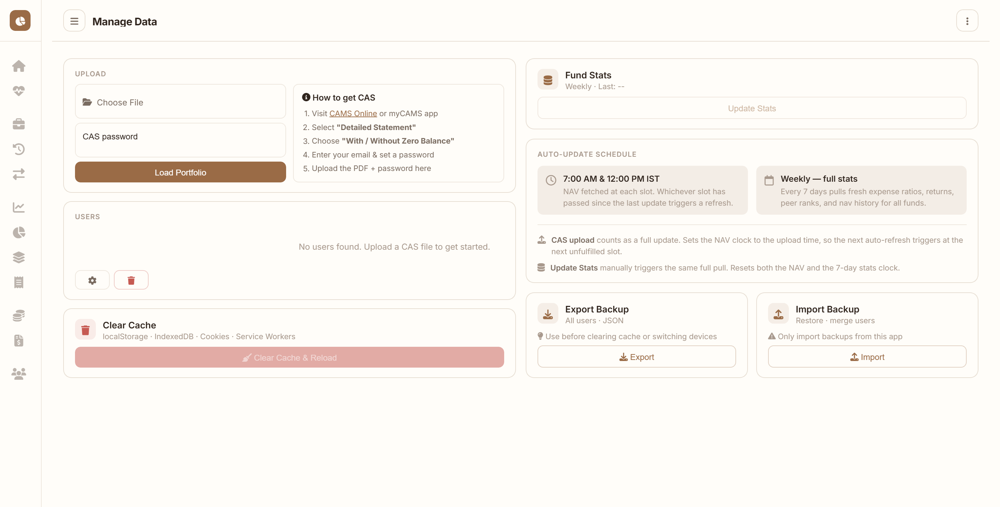

On first visit, upload your CAMS CAS PDF and enter the password to load your portfolio. The guide panel walks you through obtaining the file from CAMS Online.

---

### Manage Data — Returning User

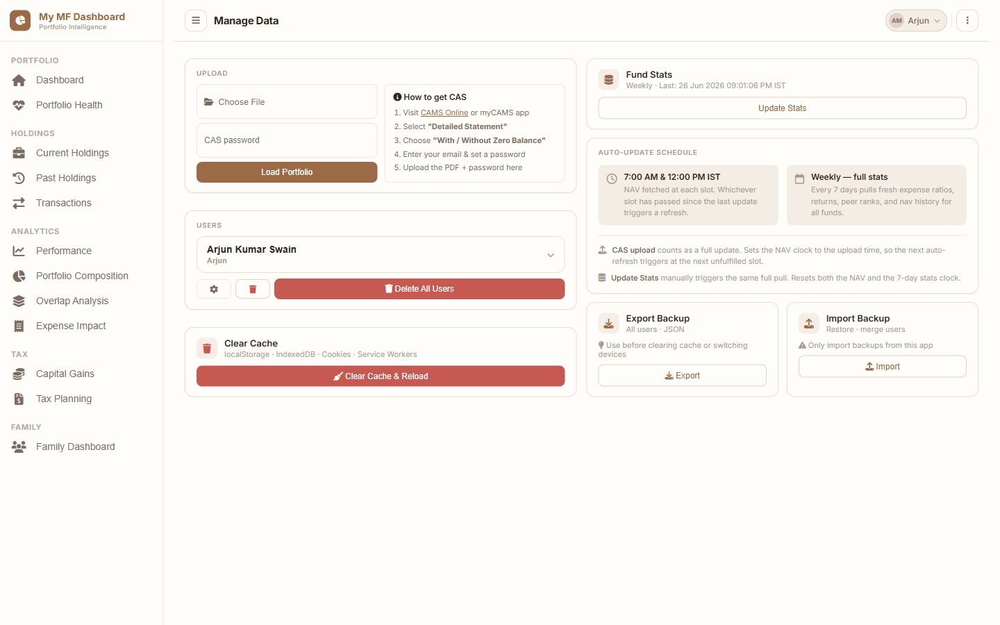

Upload a fresh CAS, manage users, trigger manual NAV or fund stats updates, and view last-update timestamps.

---

### Dashboard

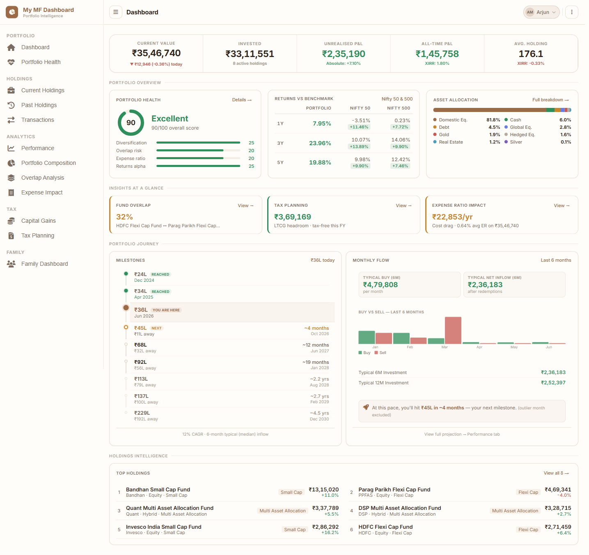

Portfolio summary cards, asset allocation, fund house distribution, sector breakdown, top holdings, and weighted returns — all at a glance.

---

### Current Holdings

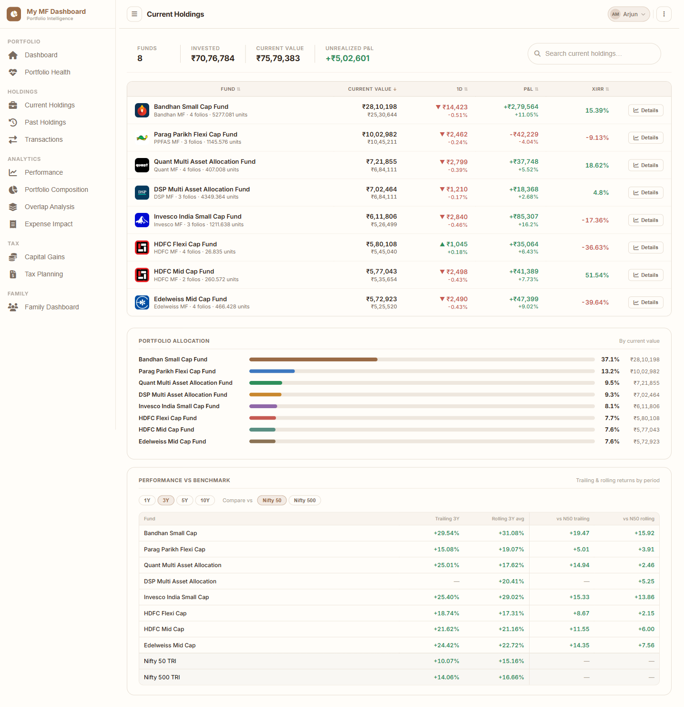

Fund cards with current value, P&L, XIRR, units, average NAV, and average holding days. Below the fund grid: **Portfolio Allocation** (horizontal bar, by current value) and **Performance vs Benchmark** — a table showing each fund's trailing and rolling returns for the selected period (1Y/3Y/5Y/10Y, default 3Y), alongside the selected benchmark (Nifty 50 TRI or Nifty 500 TRI) and alpha. Click "View Details" to drill into valuation history, benchmark comparison, and extended fund stats.

---

### Past Holdings

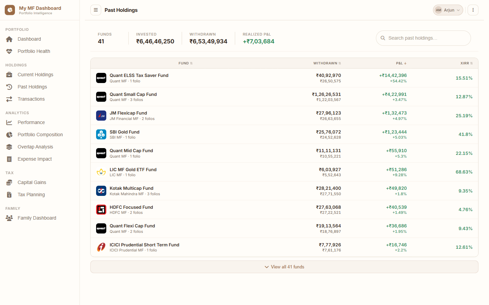

Fully exited funds with withdrawn amount, realized P&L, and XIRR.

---

### Portfolio Analysis

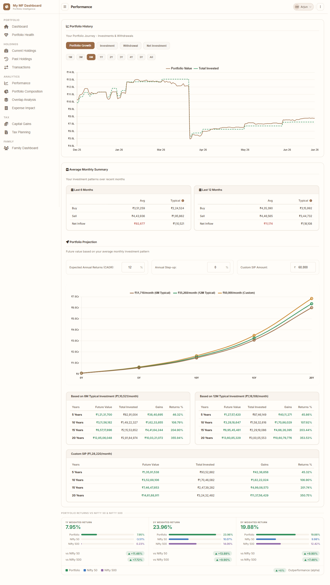

Interactive portfolio history charts, average monthly buy/sell/net summary, SIP projection calculator (up to 20 years), and a transaction calendar heatmap.

---

### Transactions

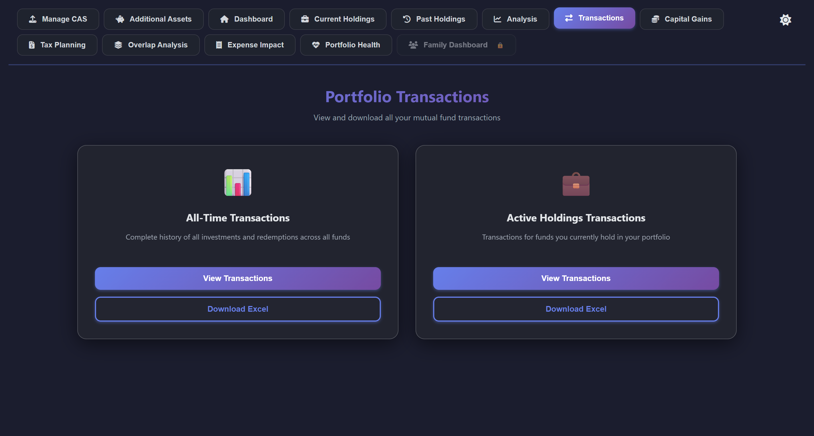

View and download all-time or active-holdings transactions as Excel files.

---

### Capital Gains

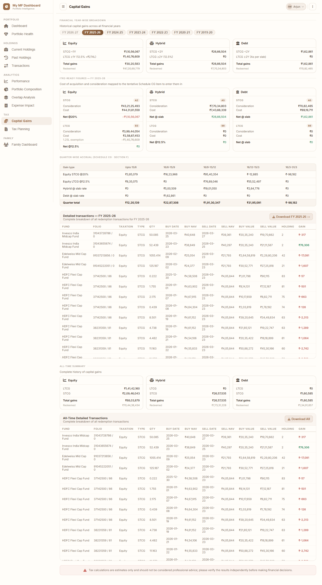

Financial year-wise STCG/LTCG breakdown, transaction-level detail, and downloadable Excel reports covering FY 2019-20 through the current year.

---

### Tax Planning

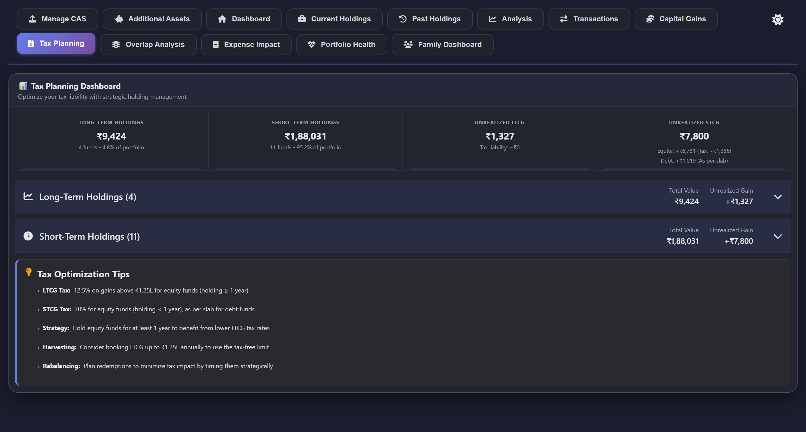

Unrealized LTCG and STCG at a glance, long-term vs short-term holdings split, and actionable tax optimization tips including LTCG harvesting.

---

### Overlap Analysis

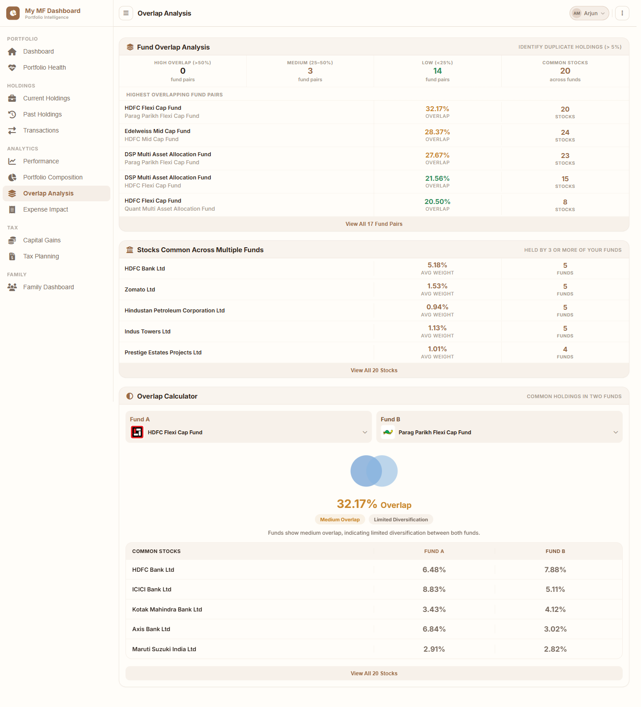

Highest overlapping fund pairs with overlap percentage and common stock count, plus a full list of stocks held across multiple funds.

---

### Expense Impact

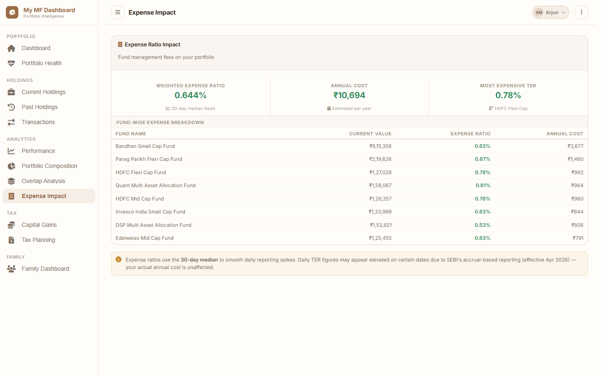

Weighted expense ratio, annual cost, and lifetime cost across all funds with a fund-wise breakdown.

---

### Portfolio Health Score

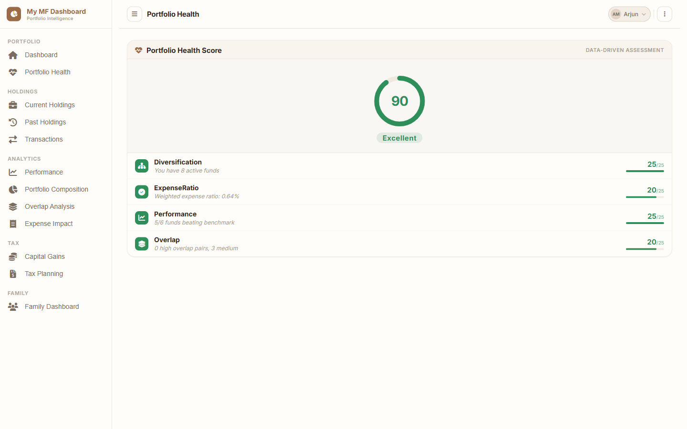

Overall score out of 100 with letter grade, plus individual dimension scores for Diversification, Expense Ratio, Performance, and Overlap.

---

### Family Dashboard

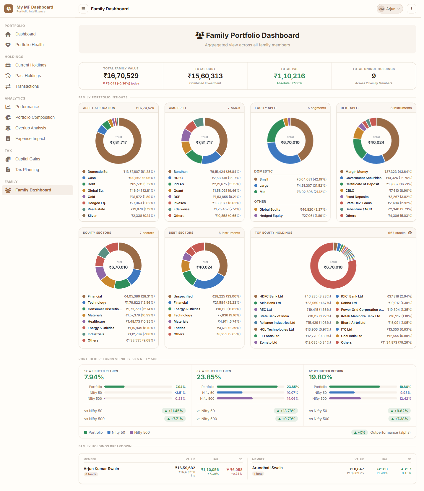

Aggregated family view with combined analytics, family-wide weighted returns, and a per-member breakdown.

---

## 🚀 Getting Started

### Prerequisites

- Modern web browser (Chrome 90+, Firefox 88+, Safari 14+, Edge 90+)
- Internet connection for CAS parsing and data updates
- CAMS CAS statement (password-protected PDF)

### Live App

Visit: [My MF Dashboard](https://mf-dashboard.github.io)

---

## 📥 How to Get Your CAS File

1. **Visit CAMS Portal** — [CAMS Online](https://www.camsonline.com/Investors/Statements/Consolidated-Account-Statement) or use the **myCAMS mobile app**
2. **Request CAS** — Select **"Detailed Statement"**, choose "With Zero Balance" or "Without Zero Balance", enter your email, and set a password
3. **Receive CAS** — Download the password-protected PDF from your email (arrives within minutes)
4. **Upload** — Open the app, go to **Manage Data**, select the PDF, enter the password, and click **Load Portfolio**

> **Note**: Currently supports **CAMS CAS files only**. CDSL/NSDL are not supported.

---

## 📊 Usage Guide

### 1. First Time Setup

1. Upload your CAS file with the password set during generation
2. Wait for processing (30–60 seconds for large portfolios)
3. Fund statistics and NAV history are fetched automatically
4. Everything is saved locally — no account needed

### 2. Dashboard

**Summary Cards**: Current value, cost, unrealized P&L with XIRR, holdings count, average holding days, all-time P&L.

**Portfolio Insights**: Asset allocation, market cap split, fund house distribution, sector distribution, top holdings, weighted returns (1Y/3Y/5Y).

### 3. Current Holdings

Fund cards with value, cost, units, P&L, XIRR, avg NAV, avg hold days. "View Details" opens valuation history, performance vs category/benchmark, and extended stats (Alpha, Beta, Sharpe, Sortino, AUM, Expense Ratio, Rating, Holdings).

Below the fund grid:

- **Portfolio Allocation**: Horizontal bar chart showing each fund's share of total current value
- **Performance vs Benchmark**: Line chart with all holdings + Nifty 50 + Nifty 500 indexed to 100 at the period start. Use period buttons (1Y/2Y/3Y/5Y/7Y/10Y) and fund filter chips to customise the view. Returns summary and best/worst performer cards (with annualized return) shown below. On mobile, chips collapse behind a filter toggle to reduce clutter.

### 4. Past Holdings

Fully exited funds — withdrawn amount, realized P&L, XIRR, invested amount.

### 5. Analysis

- **Portfolio Growth**: Value vs cost over time (1M–All time filters)
- **Investment / Withdrawal / Net Investment** bar chart views
- **Average Monthly Summary**: 6M and 12M averages for buy, sell, net inflow
- **Portfolio Projection**: Configurable CAGR %, annual step-up %, custom SIP — 5/10/15/20 year projection tables
- **Transaction Calendar**: Investment heatmap browsable by year (2019–2026)

### 6. Transactions

All-Time or Active Holdings views. View in a modal or download as Excel.

### 7. Capital Gains

- Current FY: STCG + LTCG by category with applicable tax rates
- Historical FY-wise: Year selector with detailed transactions and per-FY download
- All-time summary: Equity, debt, and hybrid breakdown with totals

### 8. Tax Planning

- Long-term vs short-term holdings split (value and unrealized gain)
- LTCG shown with tax liability (~₹0 when below ₹1.25L exemption)
- STCG: equity at 20%, debt as per income slab
- Tips on LTCG harvesting, hold-period optimization, and rebalancing timing

### 10. Overlap Analysis

Highest overlapping fund pairs with overlap % and common stock count. Full table of stocks held across multiple funds with average weight and fund list.

### 11. Expense Impact

Weighted portfolio expense ratio, total annual fees, and lifetime cost estimate. Fund-wise table with expense ratios color-coded by level.

### 12. Portfolio Health Score

Score out of 100 with letter grade (A+ to D). Sub-scores for Diversification, Expense Ratio, Performance, and Overlap — each out of 25 with progress bars and context.

### 13. Family Dashboard

Visible when 2+ users exist. Combined family value/cost/P&L, unique holdings count, family analytics (allocation, fund house, sector, market cap), family weighted returns, and a per-member breakdown card.

### 14. Manage Data

Upload fresh CAS for any user, add/switch/delete users, trigger manual NAV or stats update, and view last-update timestamps.

---

## 🧮 Calculations & Methodology

### XIRR

Newton-Raphson with bisection fallback. Cash flows: purchases (negative), redemptions (positive), current value (final positive). Calculated for overall portfolio, active holdings, and each individual fund.

### Capital Gains (FIFO)

| Fund Type | Short Term | Long Term | STCG Rate   | LTCG Rate       |
| --------- | ---------- | --------- | ----------- | --------------- |
| Equity    | < 1 year   | ≥ 1 year  | 20%         | 12.5% (>₹1.25L) |
| Debt      | < 2 years  | ≥ 2 years | As per slab | As per slab     |
| Hybrid    | < 2 years  | ≥ 2 years | As per slab | 12.5% (>₹1.25L) |

### Weighted Returns

`Σ(Return × Weight)` where weight = fund value / total portfolio value. Calculated for 1Y, 3Y, and 5Y.

### Portfolio Projection

`FV = P × ((1 + r)^n - 1) / r × (1 + r)` with optional annual step-up applied each year. Projected in parallel using 6M avg SIP, 12M avg SIP, and custom SIP.

### Performance vs Benchmark (Indexed Chart)

All series indexed to 100 at the selected period start date. Monthly data points are sampled from daily NAV history. Funds without a full period history use their earliest available NAV as the base and are labelled "since MMM 'YY". CAGR formula used for annualized return in best/worst cards: `((1 + totalReturn/100)^(1/years) - 1) × 100`.

---

## 🎨 Key Features Explained

### Smart CAS Upload

Generates a file signature from content hash, file size, and binary fingerprint. Warns if the same file is uploaded again to prevent duplicate data entry.

### Fund Valuation History

Processes all transactions chronologically against NAV history to calculate daily unit count and portfolio value for each fund. Powers fund-level and portfolio-level growth charts.

### Folio-wise Tracking

Same fund can have multiple folios (e.g. regular + direct plan). Each folio has its own FIFO queue tracked independently, then aggregated into a single fund card.

### Extended Fund Statistics

Fetched from Groww API: Alpha, Beta, Sharpe, Sortino, 1Y/3Y/5Y returns, category averages, benchmark comparison, holdings, AUM, expense ratio, rating. NAV history from MFAPI.

---

## 🛡️ Security & Privacy

- ✅ **100% Client-Side Storage**: All data in browser IndexedDB
- ✅ **No User Tracking**: Zero analytics or tracking scripts
- ✅ **No Login Required**: No accounts or authentication
- ✅ **Temporary Server Processing**: CAS file deleted immediately after parsing
- ✅ **HTTPS Only**: Secure communication with backend
- ✅ **No Third-Party Scripts**: Except CDN-hosted libraries (Chart.js, XLSX)

---

## 🛠️ Technologies Used

### Frontend

- **Vanilla JavaScript (ES6+)** — no frameworks
- **HTML5 + CSS3** — flexbox/grid layouts
- **Chart.js 3.9.1** — visualizations
- **chartjs-plugin-datalabels 2.0** — chart labels
- **SheetJS (XLSX) 0.18.5** — Excel export
- **Font Awesome 6.5.0** — icons
- **IndexedDB** — persistent local storage

### Backend

- **Node.js + Express** — API server
- **Multer** — file upload handling
- **pdfreader** — PDF parsing
- **node-fetch** — HTTP requests

**Backend URL**: `https://my-mf-dashboard-backend.onrender.com`

---

## 📱 Browser Support

| Browser           | Support          |
| ----------------- | ---------------- |
| Chrome 90+        | ✅ Full          |
| Firefox 88+       | ✅ Full          |
| Edge 90+          | ✅ Full          |
| Safari 14+        | ✅ Full          |
| Internet Explorer | ❌ Not supported |

Requires: IndexedDB, ES6+, Fetch API, File API.

---

## ⚠️ Limitations & Known Issues

### CAS File Support

| Format    | Support          |
| --------- | ---------------- |
| CAMS      | ✅ Full          |
| KFINTECH  | ❌ Not supported |
| CDSL/NSDL | ❌ Not supported |

**Mutual Funds Only**: This is a dedicated MF tracker, not for direct stocks or bonds.

### Performance

- Large portfolios (100+ funds): 30–60 second initial load
- Backend on free-tier Render — cold starts after 15 min inactivity may add 30–60 seconds to first request

### Update Restrictions

- NAV: maximum twice per day, at 7:00 AM and 12:00 PM IST slots
- Fund stats: maximum once per week

### API Dependencies

- **Groww API** (unofficial) — may change structure without notice; rate limiting may apply
- **MFAPI** (public) — historical data typically 3–5 years; occasional downtime possible

### Storage

IndexedDB is browser-dependent (typically 50MB+). Very large portfolios may require occasional cache clearing.

---

## 🐛 Troubleshooting

**CAS Upload Fails** — Verify the password is correct, ensure it's a CAMS Detailed CAS PDF, try clearing cache and re-uploading.

**NAV Update Fails** — Check if already updated today (timestamps shown in Manage Data). Backend may be on cold start — wait 30–60 seconds and retry.

**Charts Not Loading** — Wait for all data to finish loading. Try refreshing or clearing cache and reloading.

**IndexedDB Errors** — Private/Incognito mode restricts storage. Use a normal browser window.

**Backend Not Responding** — Check `https://my-mf-dashboard-backend.onrender.com/health`. Free tier needs a warmup period — wait and retry.

Open browser DevTools (F12) for detailed logs, API responses, and error messages.

---

## 🤝 Contributing

1. Fork the repository
2. Create a feature branch
3. Make and test your changes
4. Submit a pull request

Bug reports, feature requests, and documentation improvements are welcome via [GitHub Issues](https://github.com/mf-dashboard/mf-dashboard.github.io/issues).

---

## 📄 License

MIT License — see [LICENSE](LICENSE). Free to use, modify, and distribute with attribution.

---

## 👨‍💻 Author

**Pabitra Swain**

- 🌐 GitHub: [@the-sdet](https://github.com/the-sdet) | [@pabitra-qa](https://github.com/pabitra-qa)
- 📧 Email: pabitra.swain.work@gmail.com
- 💼 LinkedIn: [Connect](https://www.linkedin.com/in/pswain7/)

---

## 🙏 Acknowledgments

- **CAMS** for CAS statements
- **Groww** for the mutual fund API
- **MFAPI** for NAV history data
- **Chart.js** for visualizations
- **SheetJS** for Excel export
- All users who provide feedback

---

## 🗓️ Changelog

### Version 3.0.0 (Current)

**New Features**:

- ✅ Performance vs Benchmark table in Current Holdings — per-fund trailing and rolling returns for the selected period (1Y/3Y/5Y/10Y, default 3Y), with benchmark selector (Nifty 50 TRI / Nifty 500 TRI) and alpha column; benchmark rows pinned at the bottom; mobile shows trailing + alpha only (rolling columns hidden)
- ✅ Portfolio Allocation chart in Current Holdings — horizontal bar chart by current value
- ✅ Global benchmark data cache — Nifty 50 TRI and Nifty 500 TRI trailing and rolling returns fetched from backend, stored in localStorage, refreshed weekly; powers Performance vs Benchmark table and portfolio alpha in Dashboard and Family Dashboard
- ✅ Left-to-right draw animation on Portfolio History chart (Performance tab) on period switch

**Improvements**:

- Warm Financial Intelligence design system — calm, precise, trustworthy visual language across light and dark themes; warm charcoal dark mode (not a simple invert)
- Transactional user registration on CAS upload — user is added to the users list only after both CAS and stats writes to IndexedDB succeed, preventing zombie user state on interrupted saves
- Portfolio History chart line colors updated to design system palette (accent brown for value, success green for invested cost)
- Fund names in Performance vs Benchmark table strip trailing " Fund" suffix for compactness
- AMC names in Peers comparison now normalized through the same `standardizeTitle` mapping used for fund cards
- Fixed sidebar toggle incorrectly appearing on mobile and tablet

### Version 2.0.0

**New Features**:

- ✅ Tax Planning dashboard (unrealized LTCG/STCG, harvesting tips)
- ✅ Portfolio Projection calculator (custom SIP, CAGR, annual step-up, 20Y tables)
- ✅ Transaction Calendar heatmap
- ✅ Average Monthly Summary (6M / 12M buy/sell/net inflow)
- ✅ Family Dashboard with aggregated analytics and per-member breakdown
- ✅ Overlap Analysis tool
- ✅ Expense Impact calculator
- ✅ Portfolio Health Score (0–100, A+ to D)
- ✅ Progressive Web App (PWA) support
- ✅ Multi-user portfolio management

**Improvements**:

- Enhanced user management (add/delete/switch) from Manage Data tab
- Separate IndexedDB storage per user
- Improved mobile navigation
- Better chart rendering and animations
- Optimized IndexedDB read/write operations

**Bug Fixes**:

- Fixed NAV update reliability
- Corrected capital gains FIFO calculations
- Improved error handling and user feedback
- Better file signature detection for duplicate prevention

### Version 1.0.0

- ✅ Core portfolio tracking with FIFO calculations
- ✅ Auto-update system (daily NAV, weekly stats)
- ✅ Capital gains with FY-wise breakdown
- ✅ Transaction management with Excel export
- ✅ Portfolio insights and visualizations
- ✅ Holdings analysis (portfolio + fund level)
- ✅ Extended fund statistics

---

## ⚖️ Disclaimer

This application is provided **"AS IS"** for informational and educational purposes only. It is **not financial advice**. Capital gains calculations are **indicative only** — verify with official statements and consult a Chartered Accountant before filing taxes. NAV and fund data sourced from third-party APIs may have delays or inaccuracies. The developer assumes no responsibility for investment decisions, financial losses, or tax errors arising from use of this tool. Your data is stored locally in your browser; no financial data is permanently stored on any server.

By using this application, you acknowledge and accept this disclaimer.

---

**Made with ❤️ for the Indian mutual fund investor community**

_Star ⭐ the repo if you find it helpful!_

**Quick Links**: [Live App](https://mf-dashboard.github.io) · [Backend Repo](https://github.com/the-sdet/my-mf-dashboard-backend) · [Report Issues](https://github.com/mf-dashboard/mf-dashboard.github.io/issues) · [CAMS Portal](https://www.camsonline.com/Investors/Statements/Consolidated-Account-Statement)
